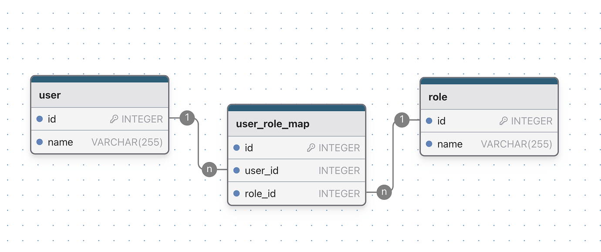

# 《你不知道的 JAVA 系列博客》 💘 失传已久 SQL JOIN 查询独门秘籍

## 从 Left Join 说起

假设你有这样一个 n2n 的关系表，代表用户和角色之间的关系。


通常通过 left join 去连接这三张表，来查询出用户及其角色的信息。

```sql
SELECT 
    u.id AS user_id,
    u.name AS user_name,
    r.name AS role_name
FROM 
    "user" u
LEFT JOIN 
    "user_role_map" urm ON u.id = urm.user_id
LEFT JOIN 
    "role" r ON urm.role_id = r.id;
```

| user_id | user_name | role_name |
|---------|-----------|-----------|
| 1       | Alice     | Admin     |
| 1       | Alice     | User      |
| 2       | Bob       | User      |
| 3       | Charlie   | Guest     |


查询出的结果中，Alice 这个用户出现了两次。这是显而易见的，因为这是一个 "Flatten" 的结果。

这样的结果是无法返回给客户端直接使用的。你需要进行处理，把重复的用户归纳到一起以后再返回给客户端进行展示，比如像下面这样：

|user_id | user_name | user's_role_array | 备注|
|--- | --- | --- | ---|
|1 | Alice | [(Admin),(User<List<Tag>>),(Vip<List<Level>>),...(n)] | 试想任意节点都可能嵌套高度为 n 的子树的情况，各节点需直接返回 List\<Map\> 的形式供前端在 html 的 `<li></li>` 和 `<select></select>` 节点中展示。|
|2 | Bob | User | |
|3 | Charlie | Guest | |

不幸的是这样的处理非常麻烦，你 join 的表越多这个代码越不好写，不相信你可以试试。

## Group_contact

看到这里，你可能会觉得 agg_string 和 group_contact 等聚合函数一定程度上能实现这个需求。但是聚合函数人如其名，作用为「聚合」。
回到上面的例子，不要局限于例子中树的高度，试想任意节点都可能嵌套一颗高度为 n 的子树，并且你的业务逻辑还需要对子树的节点做数据结构的转换。显然，字符串的「聚合」在解决这样复杂树结构的问题时显得力量不足。

这样的复杂树结构是否很常见？不，它不常见，但是它也不少见。因为除了互联网，还有很多行业也在使用数据库支撑他们的业务。

## 谈谈 ORM

有没有方便的方法来获取这个「嵌套」的结果呢？使用 Hibernate 这样的 ORM 框架是个不错的主意：

```java
@Entity
public class User {
    @Id
    private int id;

    @Column(name = "name", nullable = false)
    private String name;

    @ManyToMany
    @JoinTable(
        name = "user_role_map",
        joinColumns = @JoinColumn(name = "user_id"),
        inverseJoinColumns = @JoinColumn(name = "role_id")
    )
    private Set<Role> roles;
}

@Entity
public class Role {
    @Id
    private int id;

    @Column(name = "name", nullable = false)
    private String name;

    @ManyToMany(mappedBy = "roles")
    private Set<User> users;
}

```

Hibernate 直接帮你把数据库的结果映射到了嵌套结果集中。现在你可以直接把 `List<User>` 返回给客户端了，因为这个结果现在展示为：

|user_id | user_name | user's_role_array | 备注|
|--- | --- | --- | ---|
|1 | Alice | [(Admin),(User<List<Tag>>),(Vip<List<Level>>),...(n)] | 无论树的形状和高度，Hibernate 把各节直接映射为 List\<Map\> 的形式供前端在 html 的 `<li></li>` 和 `<select></select>` 节点中展示。|
|2 | Bob | User | |
|3 | Charlie | Guest | |

### Hibernate 的问题

使用 Hibernate 的代价就是你的心智负担很大。除了要学习很多注解以外，还有很多夸张的概念需要深入理解，才能够写出能正常运行的代码。

那么，有没有一种简单的方法，可以通过 SQL 的方式，直接查询出这种嵌套的结果集， 然后扔给客户端进行处理呢？答案是有的。

## 全新的解决方案

```java
public static void main(String[] args) {
        UserRoleEntity userRoleEntity = select(
                USER.ID,
                USER.NAME,
                array(select(ROLE.ID, ROLE.NAME)
                        .from(ROLE)
                        .join(USER_ROLE_MAP).on(ROLE.ID.eq(USER_ROLE_MAP.ROLE_ID))
                        .where(USER_ROLE_MAP.USER_ID.eq(USER.ID))
                ).as("roles")
        ).from(USER);
        System.out.println(userRoleEntity);
    }


class UserRoleEntity {
    private Long id;
    private String name;
    private List<Role> roles;
}

```

是的，如你所见，使用 JOOQ，**通过在  Java 的 main 方法里面用 Java 语言来编写「类型安全的 SQL」并通过 Array 方法一键转换为嵌套对象**，免去了学习 Hibernate 的烦恼。


## 写在最后

- 我是 Chuck1sn，一个长期致力于现代 Jvm 生态推广的开发者。
- 您的回帖、点赞、收藏、就是我持续更新的动力。
- 举手之劳的一键三连，对我来说是莫大的支持，非常感谢！
- 关注我的账号，第一时间收到文章推送。

PS：以上所有代码示例你都可以在 [Github 仓库](https://github.com/ccmjga/mjga-scaffold)中找到。如果有帮助，请顺手点一个 Star 这对我是很大的鼓励。谢谢！
