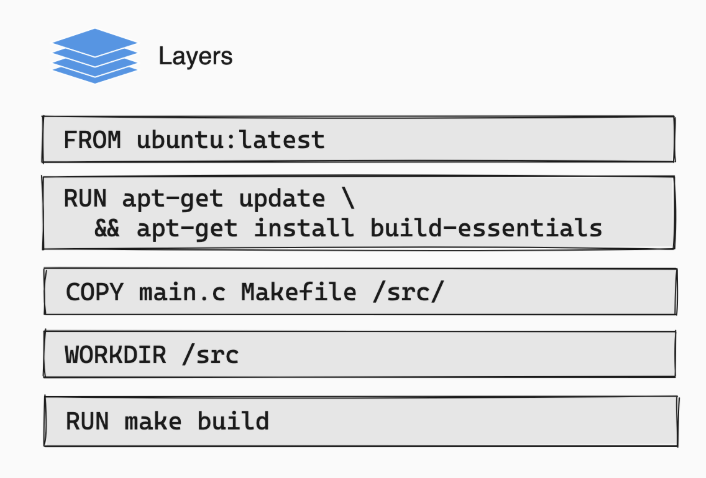
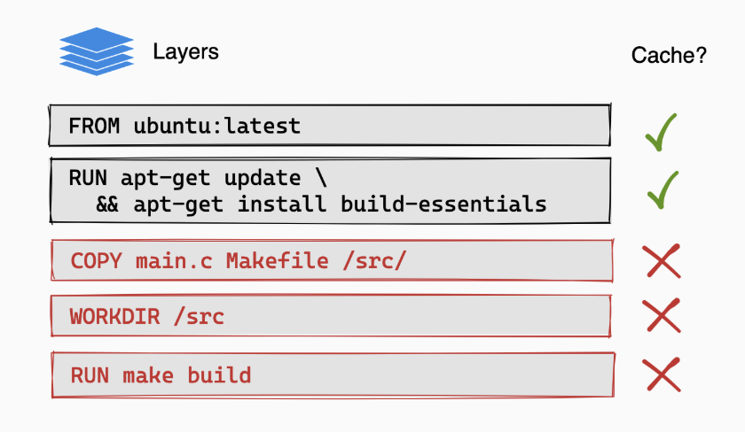

# 《你不知道的 JAVA 系列博客》💘 送给 Docker 的一封情书（第一章）

## Docker 的底层实现原理

Docker 是一种容器服务，为了方便理解你可以认为他是一个轻量级的虚拟机。通过 Docker 创建的容器，在宿主机上共享硬件资源和底层系统与接口，同时又能提供互相隔离的应用程序环境。
这是怎么做到的？由于 Linux 一切资源皆文件，所以只要简单的使用命名空间即可实现进程之间的隔离。

就像下面这个树形菜单，每个进程在自己的「文件夹/命名空间」中运作，互不干扰。

```shell
├── proc/
│   ├── 1/              # 系统初始化进程（主机）
│   │   ├── cmdline
│   │   └── status
│   ├── 2/              # 内核线程（主机）
│   │   ├── cmdline
│   │   └── status
│   ├── 100/            # 用户进程 A（主机 PID 100，用户 A 的 PID 1）
│   │   ├── cmdline
│   │   └── status
│   └── 200/            # 用户进程 B（主机 PID 200，用户 B 的 PID 1）
│       ├── cmdline
│       └── status
├── sys/
│   └── class/net/
│       ├── eth0/       # 以太网接口（主机）
│       ├── wlan0/      # 无线网络接口（主机）
│       ├── veth0/      # 用户 A 的虚拟网络接口（用户 A 的命名空间）
│       └── veth1/      # 用户 B 的虚拟网络接口（用户 B 的命名空间）
└── etc/
    ├── hostname        # 主机的主机名文件（主机）
    ├── hostname_a      # 用户 A 的主机名文件（用户 A 的命名空间）
    └── hostname_b      # 用户 B 的主机名文件（用户 B 的命名空间）
```

## Layer 与缓存

容器本身也是一个进程，未运行的容器称为容器镜像。容器镜像由指令构成，这些指令的集合成为 Dockerfile

```dockerfile
FROM ubuntu:latest

RUN apt-get update && apt-get install -y build-essentials
COPY main.c Makefile /src/
WORKDIR /src/
RUN make build
```

上面这个最典型的 Dockerfile 中的每一个指令的执行结果都会形成一个 Layer（层），而镜像是层的集合。



层是可复用的，通过指令创建的层会被缓存起来。如果下一次有同样的指令就会优先使用这个被缓存起来的层。这就是为什么第一次下载镜像时会很慢，而后面再下载有关联的镜像时就很快的原因。

```shell
Step 1/2 : FROM ubuntu:20.04
 ---> abc123...
Step 2/2 : RUN apt-get update && apt-get install -y curl
 ---> Running in def456...
Removing intermediate container def456...
 ---> ghi789...
Successfully built ghi789...
Successfully tagged my-image:latest

---------------------------------------------------------

Step 1/2 : FROM ubuntu:20.04
 ---> abc123...
Step 2/2 : RUN apt-get update && apt-get install -y curl
 ---> Using cache
 ---> ghi789...
Successfully built ghi789...
Successfully tagged my-image:latest
```

### 缓存失效

在上例中，如果你修改了 main.c 的内容，那这个指令对应的 Layer 就失效了，这个层就会被重新构建。这是期望的行为，你当然希望层能够反应最新的内容。但要注意一旦某个 layer 过期，该层以下的所有层会全部失效，这会大大增加你的构建时间。



### 缓存复用

#### 指令的分割与排序

所以为了减少构建所需时间，我们常常会想办法复用缓存，尽可能把缓存失效的影响范围缩减到最小。下面这个 dockerfile 中包含了一个  `COPY` 指令，这个指令会拷贝当前目录的所有内容到镜像的工作目录中

```dockerfile
FROM node
WORKDIR /app
COPY . .          
RUN npm install  
RUN npm build    
```

很显然，当前目录的内容肯定包含你的代码文件，而代码文件又是非常容易发生变动的。如果我们将项目的依赖定义文件和代码文件分开定义，就能创建更加内聚的 Layer ，增加了复用缓存的可能性。

```dockerfile
FROM node
WORKDIR /app
COPY package.json yarn.lock .    # 先拷贝依赖定义文件
RUN npm install                  # 安装依赖文件
COPY . .                         # 再拷贝项目文件
RUN npm build                    # 构建镜像
```

当重新构建时，如果你的依赖没有发生变化，那上一次 `RUN npm install` 形成的 Layer 就可以得到复用。因为 `COPY package.json yarn.lock .` 的内容没有发生变化。这样就节省了每次构建都重新下载依赖的时间。最后再将 `COPY . .` 这样容易发生变化的指令放到 dockerfile 的最后来执行，也能减小缓存的失效范围。
你看，软件工程的思想都是相通的，复用代码的思路在 dockerfile 中依然适用。所以良好的编码习惯的养成并不仅仅只是让你的代码看起来更漂亮一点。

#### 减少构建体积

`COPY` 指令会对指定目录下的所有文件就行拷贝。而很多东西是你不需要拷贝到镜像中的，比如 `.history .git node_modules` 等等和代码无关的产物。使用 `.dockerignore` 就可以配置想要忽略的文件或目录。

```shell
node_modules
tmp*
.history
.git
...
```

## 这就结束了吗？

本篇文章主要对 Docker 及其 Layer 缓存做一些初步介绍。文中的思路用来解决一些基本问题是可行的；但是 docker 的 Layer 设计并不能在所有问题中都发挥良好，有些问题需要更加高级的手段才能够得以解决。欢迎关注我的账号，我将在后续的章节中更新更多内容。

## 写在最后

- 我是 Chuck1sn，一个长期致力于现代 Jvm 生态推广的开发者。
- 您的回帖、点赞、收藏、就是我持续更新的动力。
- 举手之劳的一键三连，对我来说是莫大的支持，非常感谢！
- 关注我的账号，第一时间收到文章推送。

PS：以上所有代码示例你都可以在 [Github 仓库](https://github.com/ccmjga/mjga-scaffold/blob/main/src/test/java/com/zl/mjga/integration/persistence/JooqTutorialsTest.java)中找到。如果有帮助，请顺手点一个 Star 这对我是很大的鼓励。谢谢！
