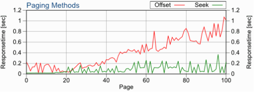

# 《你不知道的 JAVA》💘 送给 Offset & Limit 的告别气球

前文我们已经领略了 JOOQ 在分页查询和 Simple CRUD 时的风采。今来学习一个更加打破常规的概念：你可能并不需要 `Offset & Limit` 来分页。

## Limit & Offset

首先虚构一张玩家分数表：

```sql
| first_name | last_name | score | game_id |
|------------|-----------|-------|---------|
| Mary       | Paige     | 1098  | 42      |
| Tracey     | Howard    | 1087  | 42      |
| Jasmine    | Butler    | 1053  | 42      |
| Zoe        | Piper     | 1002  | 42      |
| Leonard    | Peters    | 983   | 42      |
| Jonathan   | Hart      | 978   | 42      |
| Adam       | Morrison  | 976   | 42      |
| Amanda     | Gibson    | 967   | 42      |
| Alison     | Wright    | 958   | 42      |
| Jack       | Harris    | 949   | 42      |
```

对这张表使用常规的 `Limit & Offset` 进行分页：

```sql
SELECT first_name, last_name, score
FROM players
WHERE game_id = 42
ORDER BY score DESC
LIMIT 5;
```

这个查询的执行速度很快，因为这里隐含了 `Offest 1` 的语法。通常来说这样的分页没有什么问题。但是同样的 SQL 使用不同的 Offset 效果就完全不同了，比如：

```sql
SELECT first_name, last_name, score
FROM players
WHERE game_id = 42
ORDER BY score DESC
LIMIT 5
OFFSET 100000;
```

这个查询的速度就不那么理想。因为对于 `Limit & Offset`  来说，大多数供应商的实现方案是全量查询数据然后丢弃前10000条，这严重拖慢了数据的查询速度。

## 常见的 Limit & Offset 优化

网上有很多关于 `Limit & Offset` 的优化方案，在这里我再简略阐述一下。

### 二级索引

凡事涉及到数据库的查询性能，马上就能映入脑海的优化方式就是利用索引。针对上面的查询，可以针对 game_id 与 score 建立二级索引。

```sql
CREATE INDEX idx_game_id_score ON players(game_id, score DESC);
```

利用索引我们避免了全表扫描，查询速度果然快了不少。

### 覆盖索引

使用二级索引的缺点是会导致索引回表扫描。此时有经验的玩家可能会选择把查询字段`first_name last_name score`都包含在索引中，这样就能直接从索引中获取数据，而不需要回表扫描，进一步提高性能。

```sql
CREATE INDEX idx_game_id_score_covering ON players(game_id, score DESC, first_name, last_name);
```

### 索引无法解决的问题

利用索引进行优化的本质，实际是对「查询操作」的优化。也就是说无论查询语句是否分页，都可以利用索引提高性能。但此处面临的问题，「分页查询」性能，光优化「查询操作」的性能还无法达到我们的预期。也就是说，利用索引优化的方案无法解决前10000条数据被 abandon 的问题。

🤔 看来要彻底优化分页查询的性能，得想办法换一种思路另辟蹊径。

## 重新思考

让我们去 google 上找点灵感。当我们使用 google 搜索信息时，google 采取的分页设计是你可以在 1-10 页之间跳转，并提供「上下一页」的导航。

这样的设计初看没什么大不了的，但是请注意这里并没有一个「跳转到 n 页」供你使用。谷歌为什么这样做？理由很简单，因为用户并不需要跳转到 998 页去查找什么信息，通常都是逐页浏览。当需要特定条件的信息时，指定筛选条件比跳转到 900 多页去模糊查找更加有效率。

初看有点懵，别着急，给自己点时间想想是不是这样？

## 重新设计

既然重新确立了正确的需求方向，现在就需要重新设计实现方案。好消息是当不需要「跳转到 n 页」以后，Offset 关键字就用不上了。

现在来考虑一张记录了玩家分数的表，并计划 5 条记录为一页来作为后续分页的对象。

```sql
| first_name | last_name | score | game_id |
|------------|-----------|-------|---------|
| Mary       | Paige     | 1098  | 42      | <=== page1 start
| Tracey     | Howard    | 1087  | 42      |
| Jasmine    | Butler    | 1053  | 42      |
| Zoe        | Piper     | 1002  | 42      |
| Leonard    | Peters    | 983   | 42      | <=== page1 end
| Jonathan   | Hart      | 978   | 42      | <=== page2 start
| Adam       | Morrison  | 976   | 42      |
| Amanda     | Gibson    | 967   | 42      |
| Alison     | Wright    | 958   | 42      |
| Jack       | Harris    | 949   | 42      | <=== page2 end
```

首先写一个 SQL 来实现第一页的查询。

```sql
SELECT first_name, last_name, score
FROM players
WHERE game_id = 42
ORDER BY score DESC
LIMIT 5;
```

当查询下一页时，把上一页的最后一条数据作为标志位，查询所有分数小于 983 的记录。

```sql
SELECT first_name, last_name, score
FROM players
WHERE game_id = 42
AND score < 983
ORDER BY score DESC
LIMIT 5;
```

这真是令人惊讶🫢！使用如此简单的手法，我们就获取到了「下一页」的数据。

```sql
| first_name | last_name | score | game_id |
|------------|-----------|-------|---------|
| Jonathan   | Hart      | 978   | 42      |
| Adam       | Morrison  | 976   | 42      |
| Amanda     | Gibson    | 967   | 42      |
| Alison     | Wright    | 958   | 42      |
| Jack       | Harris    | 949   | 42      |
```

通过反复使用这样的手法，我们就复刻了一个谷歌版的分页，这简直是太棒了！

不过别高兴的太早，要我说的话这里还有一个小小的缺陷，就是 `AND score < 983` 这样的查询条件相比 `Offset n` 来说阅读起来不太直观。

## 是 JOOQ 出手的时候了

`Offset n` 之所以易读，是因为他是一个包含了自然语义的语法。而 `AND score < 983 AND ORDER BY score DESC`  是一种逻辑表达，包含理解成本。为了消除这种理解成本，我们可以设计一种新式的表达方式，它就叫 `Seek Method` 。

```sql
DSL.using(configuration)
   .select(PLAYERS.PLAYER_ID,
           PLAYERS.FIRST_NAME,
           PLAYERS.LAST_NAME,
           PLAYERS.SCORE)
   .from(PLAYERS)
   .where(PLAYERS.GAME_ID.eq(42))
   .orderBy(PLAYERS.SCORE.desc())
   .seek(983) // (!)
   .limit(5)
   .fetch();
```

使用 Seek 来改造后的 SQL 如上所示：我们通过 `game_id=42` 这个条件查询 `PLAYERS` 这张表，并按照 `SCORE` 的顺序向后「寻址」 5 条记录。当你习惯了这样的表达后，理解他的成本从需要大脑思考逻辑转变为了依靠直觉——这就是生产力的提升。

由于 `Seek Method` 并不是一个 SQL 标准语法，JOOQ 为他提供了模拟支持，并抹平了不同供应商之间的差异。这就是JOOQ 的优势：对于 SQL 与数据库极其深入的理解与细致入微的语法支持。

## 使用 Seek Method 的性能优势

这里有一张 benchmark 的表格，通常来说当你的页数超过 40 以后，两者之间的差距会显著拉大。你可以在 <https://use-the-index-luke.com/sql/partial-results/fetch-next-page> 找到更加详细的内容。

## 最后一公里

本章介绍的分页解决方案实际还有两个小问题需要解决。这两个暂留给有兴趣的同学思考。

- 若分数表中出现分数相同的玩家，分页时可能会产生什么问题？
- 产生的这个问题怎么解决？

你可以把你的想法和答案写在评论区，和大家一起讨论。

## 写在最后

- 我是 Chuck1sn，一个长期致力于现代 Jvm 生态推广的开发者。
- 您的回帖、点赞、收藏、就是我持续更新的动力。
- 举手之劳的一键三连，对我来说是莫大的支持，非常感谢！
- 关注我的账号，第一时间收到文章推送。
